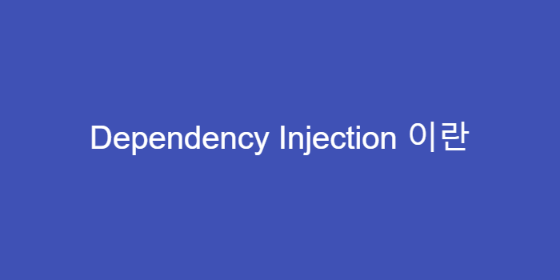

Dependency Injection, 객체지향 프로그래밍을 하다보면 한번 쯤 듣게 되는 용어중 하나인데요.

이번 글에서는 의존성 주입이 무엇이고 어떤 배경으로 생겨난 개념인지, 왜 필요한지에 대해 간단히 정리해보려고 합니다.

## 문제점

개발을 하다보면 코드에 **의존성**이 생기기 마련입니다. 그럼 의존성은 무엇이고, 왜 생겨나는 걸까요?

아래의 코드를 봐주세요.

```java
// Programmer.java
class Programmer {
    private Coffee coffee;

    public Programmer() {
    	this.coffee = new Coffee();
    }

    public startProgramming() {
    	this.coffee.drink(); // 일단 마시고 시작하자
        ...
    }
}
```

위 코드와 같이 `Programmer` 클래스에서 `startProgramming` 함수가 호출되기 위해서는 `Coffee` 클래스를 필요로 합니다. 이것을 **Programmer 클래스는 Coffee 클래스의 의존성을 가진다** 라고 합니다.

이와 같이 코드를 설계하였을 때, 코드의 재활용성이 떨어지고, 위 예제에서 `Coffee` 클래스가 수정 되었을 때, `Programmer` 클래스도 함께 수정해줘야하는 문제가 발생합니다.

즉, 결합도(coupling)가 높아지게 됩니다.

## DI(의존성 주입)를 해야 하는 이유

DI로 프로그램을 설계 했을 때, 다음과 같은 **이점**을 얻을 수 있습니다.

- Unit Test가 용이해진다.
- 코드의 재활용성을 높여준다.
- 객체 간의 의존성(종속성)을 줄이거나 없엘 수 있다.
- 객체 간의 결합도이 낮추면서 유연한 코드를 작성할 수 있다.

만약 DI를 사용하지 않고 `Coffee` 클래스의 상속을 받은 `Cappuccino`나 `Americano` 클래스를 사용해야 한다면 다음과 같이 **직접** 수정해 줘야 합니다.

```java
class Coffee {...} // interface로 설계할 수도 있다

// Coffee 클래스를 상속
class Cappuccino extends Coffee {...}
class Americano extends Coffee {...}

// Programmer.java
class Programmer {
    private Coffee coffee;

    public Programmer() {
    	this.coffee = new Cappuccino(); // 직접 수정
        // 또는
        this.coffee = new Americano(); // 직접 수정
    }

    ...
}
```

극단적으로, 만약 `Coffee` 클래스를 사용하는 클래스가 100개라면 그 중 `Cappuccino`가 필요한 클래스가 있다면 직접 수정해줘야겠죠? ~~(바로 야근 🔥)~~

이것은 굉장히 비효율적이라고 할 수 있습니다.

**의존성 주입(DI)**을 이용한다면 아래와 같이 할 수 있습니다.

```java
// Programmer.java
class Programmer {
    private Coffee coffee;

    // 그 날 마실 커피를 고를 수 있게된 개발자
    public Programmer(Coffee coffee) {
    	this.coffee = coffee;
    }

    public startProgramming() {
    	this.coffee.drink();
        ...
    }
}
```

위와 같이 필요한(의존하는) 클래스를 직접 생성하는 것이 아닌, 주입해줌으로써 객체 간의 결합도를 줄이고 좀 더 유연한 코드를 작성할 수 있게됩니다.

즉, **한 클래스를 수정하였을 때, 다른 클래스도 수정해야 하는 상황**을 막아줄 수 있습니다.

---

> #### To Quickly Recap:
>
> - DI, 의존성 주입은 필요한 객체를 직접 생성하는 것이 아닌 외부로 부터 필요한 객체를 받아서 사용하는 것이다.
> - 이를 통해 객체간의 결합도를 줄이고 코드의 재활용성을 높여준다.

PS. 부족한 부분은 계속해서 보완하겠습니다 🙏

```toc

```
