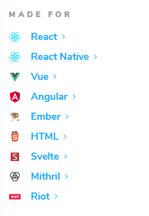
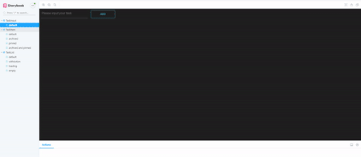
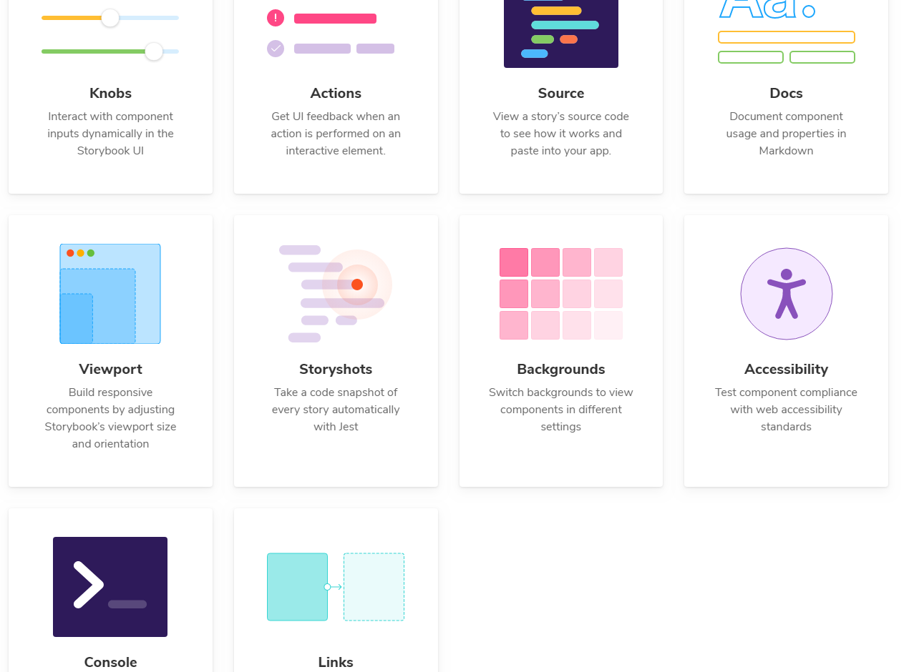
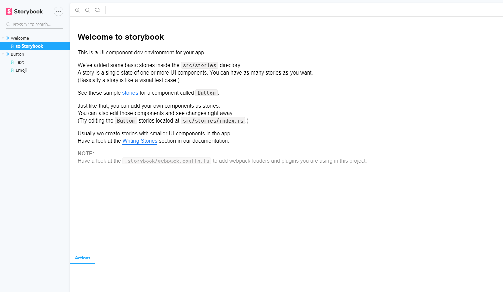
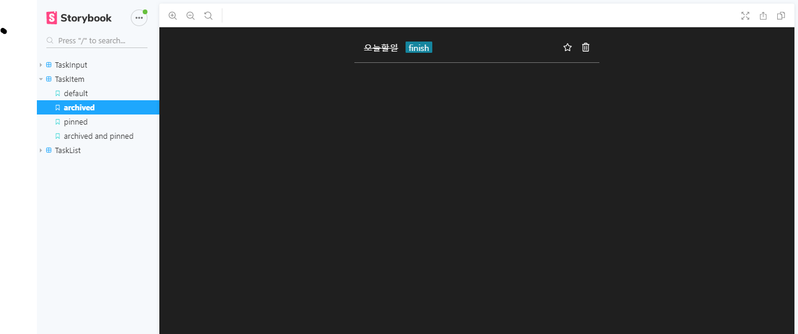
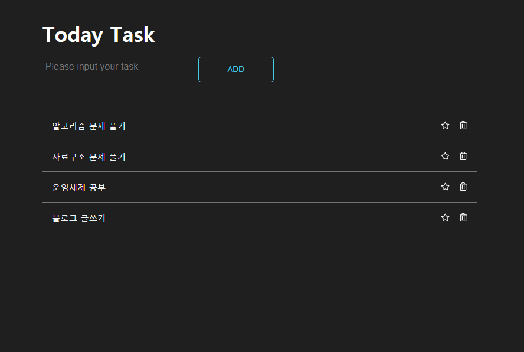
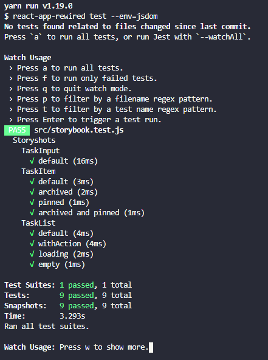

> 2021/05/17 업데이트
>
> ⚠️ Notice ⚠️
>
> 해당 포스트는 Storybook 5버전을 기준으로 작성된 포스트입니다. 최신 버전에 대한 튜토리얼은 [스토리북 문서](https://storybook.js.org/)를 찾아보시는 걸 추천드립니다.


이번 포스트에서는 **Storybook** 이라는 것을 알아볼까 합니다.

**Storybook**은 UI 구성 요소(컴포넌트)를 개발하기위한 오픈 소스 도구입니다.

예전에는 페이지 단위의 개발을 하였다면 요즘에는 컴포넌트 단위로 프론트엔드를 개발하고, 많은 분들이 React, Vue나 Angular를 이용하여 개발합니다.

여기서 컴포넌트는 외부에 영향을 받지 않고 독립적인 개체를 이루며 재사용가능한 단위라고 할 수 있습니다.

이러한 특성을 잘 지켜가며 컴포넌트를 개발할 수 있도록 도와주는 **오픈 소스 라이브러리**가 바로 **Storybook**입니다.

## 🤔 문제점

저와 같은 경우에는 보통 React.js를 이용하여 프론트 개발을 합니다.

하지만 항상 컴포넌트를 설계할 때, 필요한게 생길 때마다 해당 케이스에 맞게 컴포넌트를 설계하다 보니, 비슷한 기능을 가진 컴포넌트들이 생겨났고, **결과적으로 재활용성이 떨어졌습니다.**

개발은 컴포넌트 단위로 진행하지만 실제 개발환경은 항상 페이지 단위로 만들어지기 때문에 어쩌면 당연히 일어날 수도 있지만
웹 개발에 있어서 재활용성이 떨어진다는 것은 **생산성**이 나빠지거나 추후에 **리팩토링**을 할 때, 과정이 커지고 복잡해질 수 있습니다.

## 📙 Storybook 소개

> Storybook is a user interface development environment and playground for UI components. The tool enables developers to create components independently and showcase components interactively in an isolated development environment.
> -- Storybook introduction --

Storybook이란 UI 컴포넌트를 위해 사용자 인터페이스 개발환경 지원합니다. 또한, 개발자가 자주적으로 컴포넌트를 만들수 있게 도와주고 고립된 개발환경에서 대화형으로 컴포넌트를 보여줍니다. (blah blah)

간단하게, 격리된 환경에서 컴포넌트를 만들고 UI 상에 내가 만든 컴포넌트를 볼 수 있게 해주는 라이브러리 입니다. 물론 그 밖에도 많은 기능들을 제공합니다.

또한 Storybook은 아래와 같이 컴포넌트를 이용하는 많은 플랫폼(?), 라이브러리를 지원하고 있습니다.


### 미리보기

이 포스트에서는 React.js를 이용하여 간단한 Todo 리스트를 만들어 보면서 Storybook을 알아볼 예정입니다.

밑에 보시면 미리 작성해 놓은 Storybook이 있습니다. 컴포넌트에 넘겨줄 Props를 미리 주고 해당 컴포넌트가 어떻게 UI상에 보이는 지 알 수 있습니다.

(GIF 화질이 안좋아서 잘 안보이는 점 양해 부탁드립니다 (머쓱))


## 💡 제공하는 기능

Storybook에서 자체적으로 제공하고 있는 기능들이 있습니다. 그 중에서 유용하게 사용하고 있는 기능들 소개 해볼까 합니다.

### 에드온 Addons

Storybook에서 지원하는 플러그인(?) 같은 겁니다. 여러가지가 있지만 몇 가지만 이야기 하자면

React.js에서 props로 함수를 넘겨줄 때, **@storybook/addon-actions**을 이용하면 함수를 직접 선언하지 않고 action이라는 함수를 이용하며 props에서 받은 함수가 잘 호출되는지 알 수 있습니다.

**@storybook/storyshot**를 이용하면 Storybook을 이용한 스냅샷 테스팅을 진행할 수 있습니다.

> 위에 2가지 말고도 스토리북에서는 유용한 Addon을 지원합니다.



## 📙 Storybook-cli 설치 및 시작

먼저 간단하게 create-react-app을 이용하여 프로젝트를 생성하겠습니다.

```javascript
$ create-react-app storybook-todo
```

글로벌로 storybook-cli를 설치합니다. 이것을 이용하면 복잡한 설정이나 설치해야할 것을 자동으로 해줍니다.

```javascript
// npm 설치
$ npm install --save -g @storybook/cli

// yarn 설치
$ yarn add global @storybook/cli
```

프로젝트의 루트폴더에서 다음 명령어를 이용하면 필요한 의존성을 자동으로 설치해주고 `package.json`에 `scripts` 실행 및 빌드 명령어도 추가됩니다.

```javascript
$ getstorybook init
```

프로젝트를 시작합니다.`9009`포트(default)에 프로젝트가 열립니다.

```
$ npm storybook
$ yarn storybook
```



## ⚙️ Storybook 설정하기

Storybook을 이용하여 컴포넌트를 테스트할 때, Storybook에 나오는 테스트 케이스를 작성할 때는 test.**stories.js**라고 파일명을 짓습니다.

**.stories.js** 라고 된 모든 파일을 불러오기 위해서 필요한 모듈을 설치해줍니다.

```
$ yarn add -d require-context.macro
```

아까 명령어를 통해 Storybook을 프로젝트에 추가했다면 루트폴더에 `.storybook`이라는 폴더가 생겼을 겁니다.

`config.js`에 들가서 아래와 같이 설정해줍니다.

```javascript
.storybook/config.js

import { configure } from '@storybook/react';
import requestContext from 'require-context.macro';
import '../src/util.scss';

// *.stories.js으로 끝나는 모든 파일을 import 합니다.
const req = requestContext('../src/components', true, /\.stories\.js$/);

function loadStories() {
  req.keys().forEach(filename => req(filename));
}

configure(loadStories, module);
```

## ✍️ Storybook 작성하기

실제 예제에서는 `TastItem`, `TaskList`와 `TaskInput`가 있지만, 다 작성하기에는 많기 때문에 이 글에서는 `TastItem`을 중점적으로 설명하겠습니다.

- 실제 예제와 스타일은 관련 코드는 글 맨아래 링크의 레포지토리를 참조해주세요 :)

### TaskItem 컴포넌트

먼저 예제로 투두리스트에 들어갈 `TaskItem`을 만들어 보겠습니다.

/src/components/Task 폴더에 TaskItem폴더를 만들고, `TaskItem.js`파일을 만들어 아래 내용을 작성합니다.

```javascript
./src/components/Task/TaskItem/TaskItem.js

import React from 'react';
import PropTypes from 'prop-types';
import { FaRegStar, FaStar, FaRegTrashAlt } from 'react-icons/fa'; // 아이콘 관련 라이브러리
import './TaskItem.scss';

const Task = ({
  task: { idx, content, archive, pinned }, // 과제 정보
  onPinTask, // 과제 핀 설정 함수
  onArchiveTask, // 과제 완료 설정 함수
  onRemoveTask, // 과제 삭제 함수
}) => {

  const onArchive = (e) => {
    onArchiveTask();
    e.stopPropagation();
  }

  const onPin = (e) => {
    onPinTask();
    e.stopPropagation();
  }

  const onRemove = (e) => {
    onRemoveTask();
    e.stopPropagation();
  }


  return (
    <div className={'Task-container'} onClick={onArchive}>
      <div className={'Task'}>
        <div className={`Task-content`}>
          {archive ? (
            <>
              <span className={'Task-content-fin'}>{ content }</span>
              <span className={'Task-content-fin-icon'}>finish</span>
            </>
          ) : (
            <span>{content}</span>
          )}
        </div>

        <div className={'Task-pin'} onClick={onPin}>
          {pinned ?
            <FaStar className={'Task-pin-iconDone'} /> :
            <FaRegStar className={'Task-pin-icon'} />}
        </div>

        <div className={'Task-remove'} onClick={onRemove}>
          <FaRegTrashAlt className={'Task-remove-icon'} />
        </div>
      </div>
    </div>
  );
};

// (PropTypes 생략)

export default Task;
```

### TaskItem에 대한 Story 작성

`TaskItem`폴더에 `TaskItem.stories.js`이라는 파일을 만들어 줍니다.

아까 위에서 설정하였기 때문에 자동으로 import가 됩니다.

```javascript
import React from 'react';
import { storiesOf } from '@storybook/react';
import { action } from '@storybook/addon-actions'; // 액션 에드온
import TaskItem from './TaskItem';

// Test Data
export const task = {
  idx: 1,
  content: '오늘할일',
  archive: false,
  pinned: false,
};

// 이렇게 액션을 사용하면 함수를 직접 선언 하지 않아도 이벤트가 발생하였슬 때,
// 액션에 정의한 함수가 발생합니다.
export const actions = {
  onPinTask: action('onPinTask'),
  onArchiveTask: action('onArchiveTask'),
  onRemoveTask: action('onRemoveTask'),
};

// 스토리 추가
storiesOf('TaskItem', module) // Storybook에 표시될 폴더명
  // 데코레이터를 이용하면 아래와 같이 테스트할 스토리의 래핑 컴포넌트를 작성할 수 있습니다.
  .addDecorator((story) => <div style={{ padding: '0 20rem' }}>{story()}</div>)
  // add('스토리명', 스토리 랜더링)
  .add('default', () => <TaskItem task={task} {...actions} />)
  .add('archived', () => <TaskItem task={{ ...task, archive: true }} {...actions} />)
  .add('pinned', () => <TaskItem task={{ ...task, pinned: true }} {...actions} />)
  .add('archived and pinned', () => (
    <TaskItem task={{ ...task, archive: true, pinned: true }} {...actions} />
  ));
```

이제 storybook을 켜서 어떻게 되었는 지 확인해보겠습니다.



Story에 추가한 4가지 케이스가 모두 있고 어떻게 작동하지는 보입니다.

이렇게 만든 여러가지 컴포넌트들을 조합하고 props로 값을 넘겨주면서 하나의 페이지로 만들수 있습니다.

## 👍 완성본

- 컴포넌트를 조합하여 완성한 투두리스트
  

Storybook을 이용하여 Story를 작성하는 법을 알아보았습니다.
잘 활용한다면 컴포넌트를 설계할 때, 재사용가능한 컴포넌트로 만들고 조합하여 사용할 수 있을 것 같습니다.

예제 레퍼지토리) https://github.com/wlsdud2194/storybook-tutorials

## 🖼️ Snapshot Testing?

snapshot 테스트 케이스는 UI component를 렌더링한 뒤, 스크린샷을 찍고, 테스트 부근에 저장된 레퍼런스 이미지와 찍은 것들을 비교합니다.

만약 이전에 찍었던 이미지와 테스트했을 때와의 이미지가 다르다면 테스트에 실패합니다.

두 이미지가 다르다는 것은 **예상치 못한 변화** 혹은 **스크린샷이 UI component의 새로운 버전으로 업데이트되어야 할 때**를 말합니다.

기존에 React.js를 테스트할 때, Jest에 Snapshot Testing을 사용하곤 하지만 이번에는 Storybook에서 지원하는 addon 중 하나인 Storyshots를 사용해보겠습니다.

## 🔫 Storybook의 Storyshot

Storyshot을 이용하면 .stories.js에 정의한 대로 snapshot을 정의하며 이를 토대로 테스트를 진행합니다.

React에서는 가상DOM을 이용하기 때문에 테스트를 위한 렌더링을 하기 위해서는 `react-test-renderer`를 설치해야 합니다.

### 설치 및 적용

먼저 storyshots addon과 react-test-renderer을 설치해줍니다.

```javascript
// npm
npm install -d @storybook/addon-storyshots react-test-renderer

// yarn
yarn add --dev @storybook/addon-storyshots react-test-renderer
```

그런 다음 /src/test라는 폴더를 만들고 `storybook.test.js`라는 파일에 아래와 같이 작성해줍니다.

```javascript
import initStoryshots from '@storybook/addon-storyshots';
initStoryshots({
  /* 설정 옵션 */
});
```

그럼 이제 scripts 명령어로 테스트를 시작해줍니다.

```javascript
npm test

yarn test
```



위 사진과 같이 나오면 테스트를 성공한 것입니다.

아까만든 test폴더를 보면 `__snapshots__` 라는 폴더가 생기고 안에 든 파일을 보면 스냅샷이된 파일을 볼수 있습니다.

```javascript
// Jest Snapshot v1, https://goo.gl/fbAQLP

exports[`Storyshots TaskInput default 1`] = `
<div
  className="TaskInput-container"
>
  <div
    className="TaskInput"
  >
    <input
      className="TaskInput-input"
      onChange={[Function]}
      placeholder="Please input your task"
      type="text"
      value=""
    />
```

이 처럼 스냅샷이 저장되고 테스트 케이스가 여기에 명시된 스냅샷 시나리오와 일치하면 테스트를 성공하게 됩니다.

더욱 자세한 내용) https://jestjs.io/docs/en/snapshot-testing

### 스냅샷 업데이트

스냅샷에 있는 테스트 케이스를 수정하고 싶을 때는 `yarn test`를 통해 테스트를 끝낸 뒤 `u`를 누르거나
`package.json`에 `scripts`에 아래와 같이 수정하고 실행합니다.

```json
...
	"test-update": "react-scripts test -u"
...
```

### 테스팅 할 때 쓰면 좋은 Addon

- 테스트 케이스를 동적으로 수정할 수 있게 해준다. @storybook/addon-knobs
- 반응형을 쉽게 확인 할 수 있게 해준다. @storybook/addon-viewport
- 스토리북에 메보를 남길 수 있게 해준다 @storybook/addon-notes

## 👍 마치며 ...

저도 배우면서 사용해봤는데 실제 프로젝트에 도입했을 때, 이전에 겪었던 컴포넌트를 설계하고 병합하여 페이지를 만드는 과정에서 들였던 수고를 덜 수 있을 것 같습니다.

또한 스토리북에서 지원하는 addon 중에서 필요한 것을 골라서 프로젝트에 적절하게 적용한다면 더욱 효율적으로 컴포넌트를 관리하고 팀원과 공유할 수 있을 것 같습니다.

Ps. 글에 수정사항, 오류 지적은 언제나 환영입니다 :)

```toc

```
