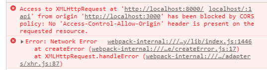

이 포스트에서는 CORS에 대한 이슈에 대해서 다뤄볼려고 합니다.

웹 개발을 하다보면 한번쯤 겪게되는 이슈로 클라이언트와 서버의 오리진이 다를 때 발생하는 이슈입니다.

## 🤔 CORS? 크로스 도메인?

CORS는 Cross Origin Resource Sharing의 약자로 **도메인** 또는 **포트**가 다른 서버의 자원을 요청하는 매커니즘을 말합니다.

이때 요청을 할때는 cross-origin HTTP 에 의해 요청됩니다.

하지만 동일 출처 정책(same-origin policy) 때문에 CORS 같은 상황이 발생 하면 외부서버에 요청한 데이터를 브라우저에서 보안목적으로 차단합니다. 그로 인해 정상적으로 데이터를 받을 수 없습니다.


> 동일 출처 정책(same-origin policy)
> 불러온문서나 스크립트가 다른 출처에서 가져온 리소스와 상호작용하는 것을 제한하는 중요한 보안 방식입니다. 이것은 잠재적 악성 문서를 격리하여, 공격 경로를 줄이는데 도움이 됩니다.
>
> -- MDN web docs --

제가 개발하면서 실제로 localhost:3000 에서 react를 실행하였고 서버는 localhost:8000번에서 실행하고 있었기 때문에 포트가 달라 CORS가 발생할 수 있는 상황 이였습니다.

```javascript
const getData = async () => {
  try {
    const serverData = await axios.get('http://localhost:8000/data');

    return serverData;
  } catch (err) {
    console.error(err);
  }
};
```

## 😃 해결방법

가장 쉬운 해결방법은 서버와 클라이언트가 같은 도메인과 포트를 사용하면 됩니다 ~~하하~~

하지만 지금은 SPA(Single Page Application)를 이용하여 개발 하고 있기 때문에 서버에서 cross-origin HTTP 요청을 허가 해주는 것이 좋습니다.

### 허가 방법

**1. Access-Control-Allow-Origin response 헤더를 추가**

```javascript
app.get('/data', (req, res) => {
  res.header('Access-Control-Allow-Origin', '*');
  res.send(data);
});
```

간단하게 모든 클라이언트에 요청에 대한 cross-origin HTTP 요청을 허가하는 헤더를 추가해 주었습니다.

그치만 rest.api의 모든 응답에 일일히 추가해주기 힘들겠죠?

**2. node.js의 미들웨어 CORS 추가**

이미 만들어진 node.js 미들웨어중 이를 해결해주는 미들웨어가 있는데 바로 CORS 입니다.

```
npm install --save cors

yarn add cors
```

이것을 이용하면 더욱 간단하게 CORS를 허가해줄 수 있습니다

```javascript
const express = require('express');
const cors = require('cors');

const app = express();

app.use(cors()); // CORS 미들웨어 추가

...
```

하지만 위에 처럼 헤더를 추가 하거나 미들웨어를 적용하면 모든 요청에 대해 허가를 하게 됩니다.
보안적으로 취약해질 수 있겠죠?

그래서 cors 미들웨어에는 여러가지 설정할 수 있습니다.
( https://www.npmjs.com/package/cors )

```javascript
const corsOptions = {
  origin: 'http://localhost:3000', // 허락하고자 하는 요청 주소
  credentials: true, // true로 하면 설정한 내용을 response 헤더에 추가 해줍니다.
};

app.use(cors(corsOptions)); // config 추가
```

## 👍 마치며 ...

웹 개발을 하면서 기본이면서도 중요한 이슈인 크로스 도메인 이슈에 대해 정리해 보았는데 정리하면서 정확히 왜 발생하였는지 어떤 맥락에서 생긴 이슈인지 안다면 더욱 쉽게 디버깅 할 수 있고 편하게 개발 할 수 있을 것 같습니다 :)

#### 요약

- cors이란 **도메인** 또는 **포트**가 다른 서버의 자원을 요청하면 발생하는 이슈이다.
- 서버와 클라이언트가 분리되어 있는 앱에서는 cross-origin HTTP 요청을 서버에서 승인해주는 것이 좋다.

```toc

```
