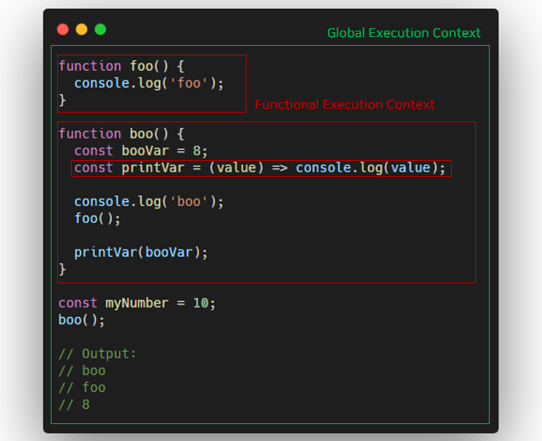

자바스크립트를 통해 개발하다보면 가끔보게 되는 키워드가 있는 데, 바로 `this`라는 녀셕입니다.

"this? 대충 이렇게 작동하는 녀석아닌가??" 하고 지나칠 수 있지만, 정확히 알고 적절하게 활용한다면 더욱 깔끔하고 디버깅이 편한 코드를 작성할 수 있을 것입니다.

## 일단 this를 찍어보자

`F12`키를 눌러 console에서 `this`를 한번 찍어봅시다. 그러면 아래와 같은 값이 나올 것 입니다.

```javascript
> this
> Window {
applicationCache: ApplicationCache {status: 0,
LocalNTP: ƒ LocalNTP()
alert: ƒ alert() oncached: null…}
assert: ƒ assert(condition, opt_message)
assertInstanceof: ƒ assertInstanceof(value, type, opt_message)
...
}
```

네, **Window 객체**가 나옵니다. Window 객체는 일반적으로 브라우저의 요소와 자바스크립트 엔진과 관련된 모든 정보를 포함하고 있는 객체입니다.

하지만 단순히 `this` = `Window 객체` 라면, 이 글을 쓰지 않았겠죠?

## 문법에 따라 this가 바뀐다?

전에 커뮤니티에 이런 글이 하나 올라왔었습니다.

> Q . `function` 과 `() => {}` (화살표 함수)의 차이점이 무엇인가요?
>
> A : "this가 달라요"
> B : "function은 this를 가지고, 화살표함수는 this를 가지지 않아요"

틀린 답변은 아니지만, 정확히 어떻게 `this`가 다르다는 걸까요?

입문자 분들이 말 뜻대로 생각했을 때, 아래 코드처럼 생각할 지도 모르죠.

```javascript
// 서로 다른 값이 출력??
function normalFunc() {
  console.log(this);
}

const arrowFunc = () => {
  console.log(this);
};
```

"function은 `this`를 가지니까 자기자신 즉 `normalFunc`를 가리키고, 화살표함수는 `this`를 안가지니까 Window 함수를 가지겠구나?" 라고 생각할 수 있지만, 출력해보시면 둘 다 **Window 객체**를 출력하는 것을 알 수 있습니다.

그럼 대체 뭐가 다른걸까요? 이글을 다 읽고 나시면 알게 되실 겁니다. ㅋㅋ

우선 **실행 컨텍스트**라는 개념을 알아야 합니다.

## 실행 컨텍스트(Execution Context)

**실행 컨텍스트**란 자바스크립트 코드가 실행되고 연산되는 범위를 나타내는 추상적인 개념으로 코드가 실행된다면 실행 컨텍스트 내부에서 작동하고 있는 것이라고 보면 됩니다.

실행 컨텍스트는 크게 3가지로 분류되는 데, 메인 주제가 아니므로 주요한 2가지만 간단하게 알아보겠습니다. (자세한 내용은 구글에...)

### Global Execution Context

기본적으로 코드가 실행되는 영역이며, 여기서 글로벌 객체인 Window 객체를 생성하며, `this`를 글로벌 객체(Window 객체)로 설정해줍니다.

그래서 아까 `this`를 찍었을 때, Window 객체가 출력된 것이죠.

### Functional Execution Context

각각의 함수가 가지는 실행 컨텍스트로, 함수가 호출될 때 해당 실행 컨텍스트 생성이 됩니다.



## 언제 this가 바뀔까

this는 기본적으로 Window 객체를 말합니다(Node.js는 Global 객체).

하지만 this의 값이 바뀌는 경우가 있습니다. 때문에 this 값이 어떻게 바뀌고 있는지, 해당 this가 무슨 값인지 알기 위해선 코드의 문맥을 살펴볼 필요가 있습니다.

### 객체의 메소드를 호출하는 경우

```javascript
const myObj = {
  myValue: 6,
  myWindow: this,
  myFunc: function () {
    console.log(this);
  },
  myArrow: () => {
    console.log(this);
  },
};

console.log(myObj.myFunc()); // myObj 객체
console.log(myObj.myArrow()); // Window 객체
```

출력되는 this의 값이 바뀌었나요? MDN에는 아래와 같이 설명하고 있습니다.

> - 함수를 어떤 객체의 메소드로 호출하면 this의 값은 그 객체를 사용합니다.
> - ES2015는 스스로의 this 바인딩을 제공하지 않는 화살표 함수를 추가했습니다.
>
> -MDN web docs-

이것이 아까 위에서 나왔던 답변의 정확한 의미입니다. `function` 키워드는 해당 객체를 바인딩하여 `this`의 값을 변경하는 것이고, `() => {}`는 상위 객체의 this를 그대로 이어받아(?) 사용하는 것입니다.

### 생성자를 통해 객체를 생성하는 경우

```javascript
function Programmer(name, age) {
  this.name = name;
  this.age = age;
}

// 생성자를 사용하지 않은 경우 - 단순 호출
const covy = Programmer('Covy', 20); // covy 변수는 undefined
console.log(window.name, window.age); // Covy 20

// 생성자를 통한 객체 생성
const tony = new Programmer('Tony', 25);
console.log(tony.name, tony.age); // Tony 25 - this가 해당 객체에 바인딩됨
```

`new` 키워드를 통해 객채를 생성하면, `this`가 해당 객체에 바인딩 되어 해당 값을 읽게 되는 것입니다. es6에 추가된 `class`를 사용하면 동일하게 작동하는 것을 볼 수 있습니다.

### 예외적인 경우

Jquery, React 등에 일부 라이브러리에서 엘리먼트에 이벤트를 추가할 때, 콜백함수에서 `this`를 사용하면 값이 바뀌는 경우가 있습니다.

아래 코드를 봐주세요

```javascript
// Jquery
$('div').on('click', function () {
  console.log(this); // <div>
  function normalFunc() {
    console.log(this); // Window 객체
  }
  const arrowFunc = () => {
    console.log(this); // <div>
  };
});
```

위 코드처럼 라이브러리 상에서 this를 바인딩 해주는 경우가 있기도하니 this를 사용할 때는 해당 라이브러리의 document를 찾아보는 것도 중요할 것입니다. (아니면 stack overflow)

# apply(), call(), bind() ?

사실 `this`는 이 3개를 이해하기 위한 발판입니다. 개발하시면서 자동완성 땜에 한번쯤 보신적 있으실겁니다.

자바스크립트에서는 `this`를 자유자제로 바꿀 수 있도록 해주는 메소드를 제공하는 데, 바로 **apply, call, bind** 입니다.

> ES5는 함수를 어떻게 호출했는지 상관하지 않고 this 값을 설정할 수 있는 bind 메서드를 도입했습니다.
>
> -MDN web docs-

```javascript
const Tom = {
  age: 25,
  gender: 'man',
};

function printProfile(name) {
  console.log(name, this.age, this.gender);
}

printProfile.apply(Tom, ['Tom']); // Tom 25 man
printProfile.call(Tom, 'Tom'); // Tom 25 man
printProfile.bind(Tom, 'Tom').call(); // Tom 25 man
```

- apply : `call` 함수와 유사하지만, 매개변수는 배열로 받는것에 있어 차이가 있다.
- call : 객채를 바인딩 함과 동시에 호출을 한다.
- bind : 바인딩이된 함수를 반환하며, 한번더 호출시 함수를 실행한다.

## 마치며

사실 자바스크립트로 개발하면서 this를 보게될 일은 적습니다. 하지만 모르고 코드를 쓰는 것보다. 알고 더욱 좋은 코드로 발전 시키는 것에는 분명한 차이가 있을 것입니다.

+) 글의 오류, 오타가 있다면 언제든 댓글을 남겨주세요 😀

```toc

```
