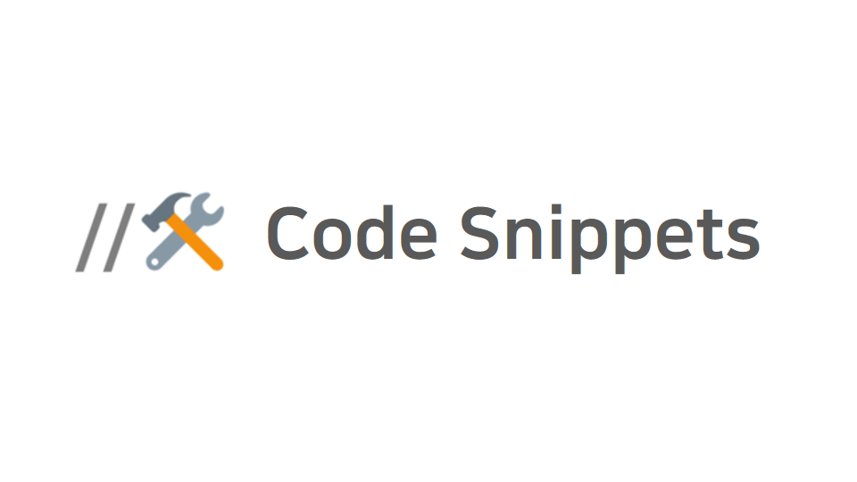
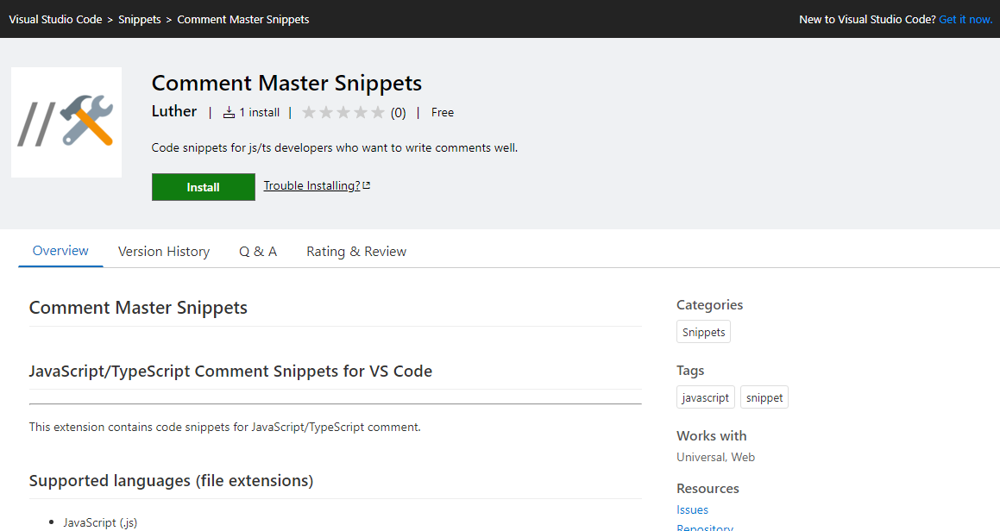

개발하면서 자주 쓰게 되는 코드 조각(?)들을 단축키로 만들어 놓은 것을 **코드 스니핏 code snippet**이라고 하는 데요.

그 예로 JavaScript나 React.JS와 같은 언어나 라이브러리에서 자주 쓰이는 코드들을 모아둔 Snippet Extension인 [JavaScript (ES6) code snippets](https://marketplace.visualstudio.com/items?itemName=xabikos.JavaScriptSnippets), [Reactjs code snippets](https://marketplace.visualstudio.com/items?itemName=xabikos.ReactSnippets) 등이 있습니다.

최근 회사에서 코드에 주석을 쓸 때, 몇가지 형식을 약속하여 자주 쓰게됬던 주석이 있는 데, 아래 코드와 같습니다.

```
/* -----------------------------------------------------------
  주석의 내용
  blur blur
----------------------------------------------------------- */

//----
// 주석 내용
//----
```

이 처럼 단락을 구분 짓고, 주석을 읽을 때 더욱 편하게 하기 위하여 이와 같은 주석 포멧을 채택하였습니다. 하지만 주석의 형식을 정확하게 기억하지 못하여 `-`의 개수를 통일하지 못하거나 매번 쓸 때마다 어디서 복붙해와야한다는 점에서 불편함을 느꼈었습니다.

이러한 문제점을 해결하기 위해 VSCode 에디터에서 지원해주는 기능을 활용하기로 하였는 데, 그개 바로 Code Snippet 입니다.

## 사용자정의 Code Snippet 넣기

VSCode에는 간단한 설정만으로 사용자정의 Code Snippet을 만들수 있습니다.

1. 단축키 `shift` + `command` + `p` 입력, 그리고 `snippets` 입력
2. `Select Preferences: Open User Snippets` 선택
3. 스니핏을 추가하고자하는 언어를 선택
4. 열린 창에 설명대로 스니핏 추가, 자세한 건 [vsdoc 참조](https://code.visualstudio.com/docs/editor/userdefinedsnippets)

위 방법대로 하면 사용자정의 스니핏을 사용할 수 있습니다.

## VSCode Extension 으로 배포하기

위처럼 각자 사용자 정의를 해서 스니핏을 만들어서 사용할 수도 있겠지만, 일일히 설정하기 쉽지 않고 형식이 바뀌었을 때 매번 변경해주어야하기 떄문에, 이를 VSCode Extension으로 만들어 배포해보겠습니다.

### Snippet Extension Project 구성

프로젝트 구성은 아래 레포지토리를 참조해주세요.

- [https://github.com/wlsdud2194/vscode-comment-master](https://github.com/wlsdud2194/vscode-comment-master)

### 배포하기

1. https://dev.azure.com 에서 organization을 생성
2. Personal Access Token (PAT) 발급 (이때, Scope에 Marketplace 권한을 Manage로 줍니다)
3. [vscode marketplace](https://marketplace.visualstudio.com/)에서 management page로 들어가 publisher 생성

package.json에 "방금 만든 Publisher"를 명시합니다.

```
{
  ...,
  "publisher": "방금 만든 Publisher 명",
  ...
}
```

이제 vsce (Visual Studio Code Extensions)를 설치하고 다음 명령을 실행해주면 배포가 완료됩니다.

```
$ npm install -g vsce
$ vsce login
$ vsce publish
```

그럼 management page 에서 배포된 extension을 확인할 수 있고 어느정도 시간이 흐른 후에는 실제로 vscode 내부 마켓 플레이스에서 검색 되어집니다.

- 완성본: [https://marketplace.visualstudio.com/items?itemName=wlsdud2194.vscode-comment-master](https://marketplace.visualstudio.com/items?itemName=wlsdud2194.vscode-comment-master)



## 참조

- https://stackoverflow.com/questions/29995863/how-to-add-custom-code-snippets-in-vscode
- https://code.visualstudio.com/api/working-with-extensions/publishing-extension

```toc

```
