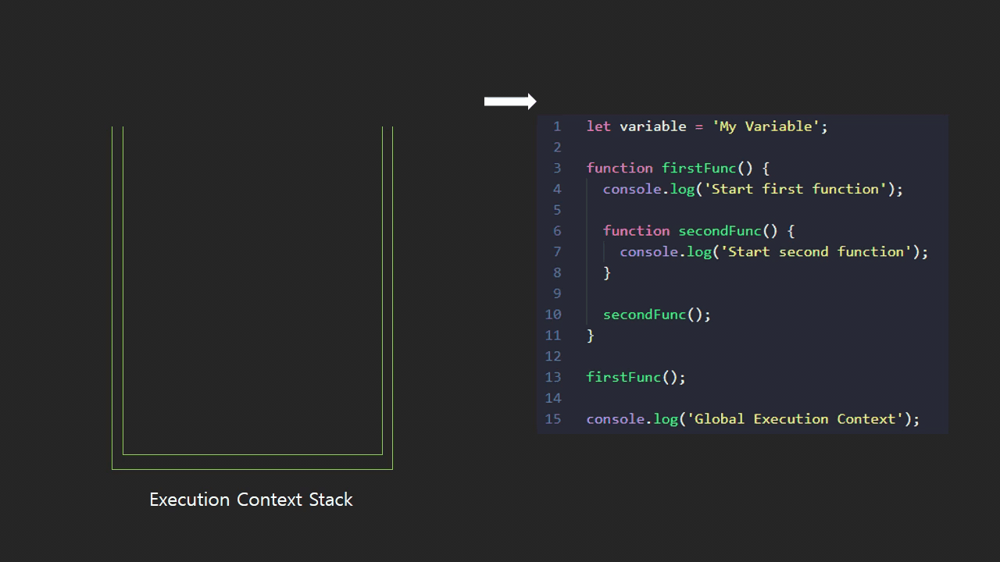
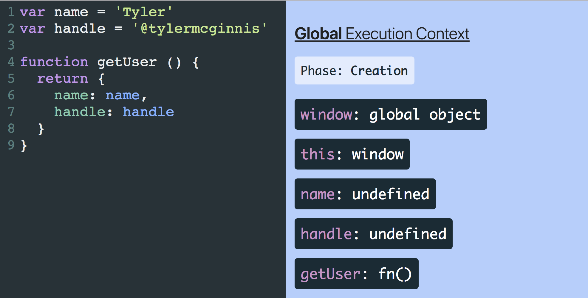
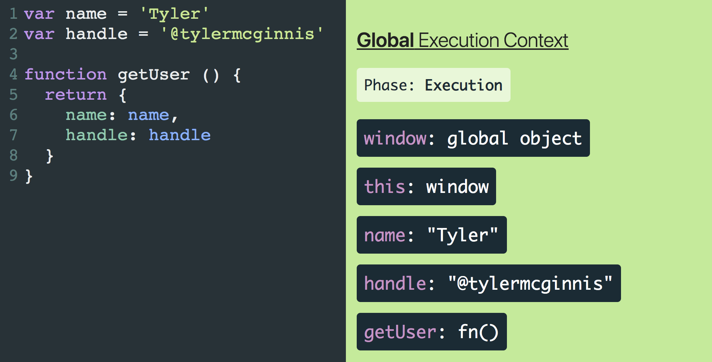

실행 컨텍스트(Execution Context)란 자바스크립트 코드가 실행되고 연산되는 범위를 나타내는 추상적인 개념으로, 코드가 실행된다면 실행 컨텍스트에서 작동하고 있는 것이라고 보면 됩니다.

실행 컨텍스트는 자바스크립트의 다양한 개념 중 기본이 되는 개념이기 때문에, 이를 이해하고 자바스크립트 코딩을 한다면 코드를 이해할 때 많은 도움이 되리라 생각합니다.

---

## 실행 컨텍스트, 왜 필요할까?

앞서 말했듯이 코드를 실행하기 위해 필요한데, 어떻게 실행하기 위함인지가 중요합니다.

소프트웨어 구현 전략 중에 하나는 코드를 여러 조각(functions, modules, packages 등등)으로 나누는 것입니다. 이렇게 분리하는 이유는 단 하나, 프로그램의 복잡성을 분리하고 관리하기 위함입니다.

이제 코드를 작성하는 입장이 아닌 코드를 해석하는 자바스크립트 엔진 관점에서 생각해봅니다. 코드 해석의 복잡성을 관리하기 위해 코드의 영역을 분리하여 위와 같은 전략을 사용할 수 있는 데 그게 바로 **실행 컨텍스트(Execution Context)** 입니다.

functions, modules, packages가 코드 작성의 복잡함을 관리할 수 있게 해주는 것 처럼, 실행 컨텍스트도 자바스크립트 엔진이 코드 해석과 실행의 복잡성을 관리할 수 있도록 해주는 것입니다.

---

## 실행 컨텍스트의 종류

이 처럼 코드 해석과 실행의 복잡성을 관리하기 위해 3가지의 실행 컨텍스트가 존재합니다.

### **Global Execution Context (GEC)**

글로벌 실행 컨텍스트(GEC)는 브라우저 혹은 (Node.js와 같은) 런타임에서 처음 파일을 로드하여 해석을 시작할 때 생성되며, JS 코드를 실행하는 기본적인 실행 컨텍스트입니다. 함수나 오브젝트 같은 코드들은 모두 GEC 내부에서 실행됩니다.

또한 자바스크립트 엔진은 싱글 쓰레드이기 때문에 하나의 글로벌 환경에서만 JS 코드를 실행할 수 있습니다. 따라서 GEC가 두개 이상 생성될 순 없습니다.

### Functional Execution Context (FEC)

함수 실행 컨텍스트(FEC)는 JS엔진이 **함수 호출될 때 마다** 생성되는 컨텍스트로, 각각의 함수는 자체 실행 컨텍스트를 가지기 때문에 여러 개가 존재할 수 있습니다.

### Eval Functional Execution Context

`eval` 함수 내의 실행 컨텍스트를 의미합니다.

> **약간의 TMI**
>
> eval 함수는 문자열로된 자바스크립트 코드를 실행하게 해주는 함수로 JS 인터프리터가 바로 코드를 실행해주는 뭔가 위험한(?) 함수입니다.
>
> - 더 자세한 내용: [MDN Web Docs](https://developer.mozilla.org/ko/docs/Web/JavaScript/Reference/Global_Objects/eval)

---

## 실행 컨텍스트 스택 (Execution Context Stack)

실행 컨텍스트이란 스택(Stack, Last in First out) 자료구조를 이용하여 스크립트의 생명주기 동안 생성된 모든 실행 컨텍스트를 저장하는 하는 스택입니다. 일종의 **[Call Stack](https://ko.wikipedia.org/wiki/%EC%BD%9C_%EC%8A%A4%ED%83%9D)** 이죠.

기본적으로 GEC가 스택에 맨 아래에 존재하며, GEC의 코드를 실행하는 동안 함수가 호출 되면 해당 함수에 대한 FEC가 생성되면서 실행 컨텍스트 스택 위에 푸시(push)되며, JS엔진은 스택의 맨 위에 있는 함수를 실행합니다. 푸시된 컨텍스트의 모든 코드가 실행이 되면 해당 컨텍스트를 팝(pop) 하고, 그 아래에 있는 함수를 이어서 실행합니다.



---

## 생성단계 & 실행단계

자바스크립트 엔진은 2단계로 실행 컨텍스트를 생성하고 각 단계마다의 역할을 가지고 있습니다.

1. 생성단계 (Creation phase)
2. 실행단계 (Execution phase)

### 생성단계 (Creation phase)

생성단계는 JS엔진이 함수를 실행은 하지 않고 **호출을 하는 단계**입니다. 이때 JS엔진이 실행 컨텍스트를 생성하면서 아래와 같은 작업을 합니다.

1. 함수와 변수를 위한 메모리 공간 확보
   1. GEC의 경우, 글로벌 변수 생성(브라우저는 `window` 객체, Node.js는 `global` 객체)
   2. FEC의 경우, `arguments` 변수 생성
2. 스코프 체인(scope chain) 생성
3. this 값: 스코프 체인 생성 후 this의 값을 결정

아래 그림을 보면 (GEC의 경우) 생성단계에서 글로벌 변수와 `this`를 할당합니다. 여기서 주의깊게 봐야할 것은 선언식 함수는 메모리에 배치하고 변수 선언에는 기본값 `undefined`를 할당하는 것입니다.



### 실행단계 (Execution phase)

실행단계가 되면 JS엔진은 한 줄식 코드를 실행(런타임) 하는데. 이 단계에서 변수에 값을 할당하고 함수 호출을 실행합니다.



---

## 여기까지 잘 왔는가?


쓰다보니 글이 좀 많아진 것 같지만, 여기까지 잘 이해하셨다면 이제 자바스크립트 엔진이 어떤식으로 실행 컨텍스트 나누는지, 또 어떻게 이를 실행하는지 알게 되었을 것입니다. 그렇다면 실제 우리가 개발을 하면서 어떤식으로 이러한 개념이 활용 되는지 알아봅시다.

---

## 호이스팅 (Hoisting)

> ⚠️ **참고** ⚠️
>
> `let`, `const` 로 선언된 변수는 초기화가 되기 전에 접근하면 에러를 발생시킵니다.

1. **생성단계**에서 `var` 변수는 undefined 초기화 되고 함수는 메모리에 올라갑니다.
2. 실행단계가 되었을 때, 함수의 경우에만 함수가 정의되지 않아도 호출이 가능합니다.
   - 화살표 함수에 경우에는 변수로 취급되기 때문에, `undefined`로 초기화 되어 호이스팅이 되지 않습니다.

```js
console.log(normalVar); // undefined
console.log(originFunc); // [Function: originFunc]

var normalVar = 'Normal';

function originFunc() {
  console.log('Origin Function');
}

console.log(normalVar); // 'Normal'
console.log(originFunc); // [Function: originFunc]

// -----

arrowFunc(); // Uncaught TypeError: arrowFunc is not a function  <-- Error!!

var arrowFunc = () => {
  console.log('Arrow Function');
};
```

---

## 클로저 (Closure) & 스코프 체인 (Scope Chain)

1. 생성단계에서 함수가 메모리에 올라가고 변수들을 초기화 합니다.
2. 실행단계가 되면 `addAndMulti`가 호출되고 `value`를 계산한 뒤 함수를 반환합니다. 이때 함수를 반환하기 때문에 **“클로즈 스코프”**가 남아 있는 상태로 `multi` 변수에 함수가 할당 됩니다.
3. `multi` 변수에 할당된 함수를 호출하면 `multiValue` 가 호출되고 클로즈 스코프 내에서 함수가 실행된 후, 반환값을 `result`에 저장하고 종료가 됩니다.

```js
function addAndMulti(num1, num2) {
  const value = num1 + num2;

  return function multiValue(num3) {
    return value * num3;
  };
}

var multi = addAndMulti(2, 3);
var result = multi(5);

console.log(result); // 25
```

---

## 참조

- 썸네일 원본: [https://www.youtube.com/watch?v=vjasxz8wvRA](https://www.youtube.com/watch?v=vjasxz8wvRA)
- [https://ui.dev/ultimate-guide-to-execution-contexts-hoisting-scopes-and-closures-in-javascript/](https://ui.dev/ultimate-guide-to-execution-contexts-hoisting-scopes-and-closures-in-javascript/)

```toc

```
