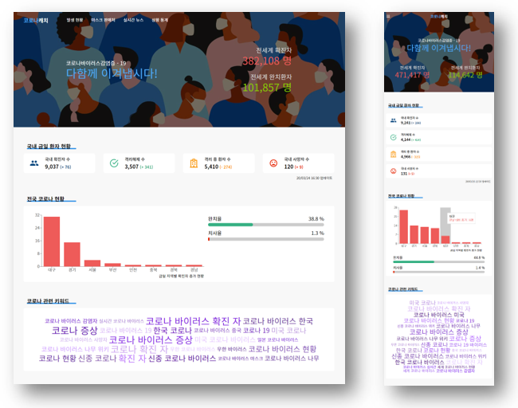
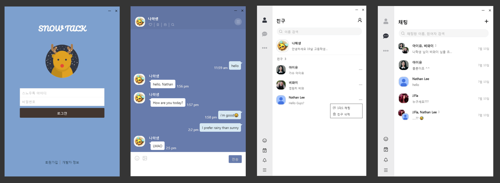

어느 덧 2020년이 끝나가고 있습니다. 올해는 정말 많은 일이 있었던 것 같은데요. 힘들고 지치는 일도 많았지만 그만큼 성장한 한 해를 보내지 않았나 생각이 듭니다. 올해가 가기 전에 있었던 일들을 기록하고 반성해보면서 더 나은 새해를 맞이해보려 합니다. 🙂

## 😷 2020 이모저모

2020년 올해는 3월부터 유행하기 시작한 코로나19 바이러스로 일상이 송두리째 바뀐 년도였죠. 마스크는 없으면 허전할 정도로 일상이 되었고, 많은 분이 일하는 데 있어서 어려움을 겪고 있는 지금입니다. 하지만 각자의 자리에서 책임감을 가지고 노력해주신 덕분에 한국은 다른 나라에 비해 (여전히 많지만) 적은 감염이 일어나지 않았나 생각이 듭니다.

코로나 때문에 약 2개월을 집에서 보내고 취업을 일찍한 탓에 마지막 고등학교 3학년 생활을 겨우 2~3개월밖에 하지 못해서 올해 학교에서 있었던 일을 생각했을 때, 특별하게 많이 생각나는 게 없는 것 같아 아쉬움이 남는 것 같습니다.

## ⛅ 지난 해 목표

작년 회고록에 썼던 목표를 Notion에 적어놓고 조금씩 이뤄나가기 위해 노력했었는데요. 전체 목표에 약 **90%** 정도 완료한 것 같아 나름 만족스러운 한 해가 아니었나 생각이 듭니다.

### ✔️ Golang 공부해보기

처음 Golang을 접했을 때는 문법이 신기하고 간편해 보여서 공부를 시작하였지만, 다른 언어에 비해 적은 메모리 사용과 빠른 실행속도 부분에서 매력을 느껴 알고리즘 문제를 풀거나 문법을 공부할 때 더욱더 재밌게 공부했던 것 같습니다. ~~(Golang 쵝오!!)~~

최근에는 제가 자주 이용하는 정보(날씨, IT 뉴스, 블로그)를 수집해, 아침 점심 저녁으로 알림을 보내 주면 좋을 것 같아 그동안 공부한 Golang을 이용해 간단한 챗봇 개발을 진행 중입니다.

### ✔️ 시간관리, Todoist를 더욱 열심히 사용하기

2월 까지는 Todoist를 썼었는데, 장문의 메모나 무언가를 기록하기에는 조금 불편함을 느껴서 **Notion**으로 갈아타게 되었습니다. 아침에는 오늘 무엇을 할 것인지 목표를 정해 기록해놓고, 저녁 시간에 오늘 목표를 평가하고 **TIL**를 작성하여 효율적으로 시간 관리와 일을 할 수 있도록 하고 있습니다.

### ✔️ "도담도담" 서비스 배포하기

학교에서 자주 사용하는 다양한 신청을 편리하게 신청하고 관리하기 위해 개발한 "도담도담" 서비스를 3월부터 배포하여 사용할 예정이었지만, 코로나로 인해 개학이 미루어 지면서 실제 서비스 사용은 5월부터 했었습니다. 비록 늦어졌지만, 학교에 정상적으로 배포되어 많은 학생과 선생님분들이 사용해주셨고, 팀원들과 1년 동안 만든 프로젝트가 성공적으로 마무리된 것 같아 만족스럽게 생각합니다.

지금은 후배님들이 인수인계를 받아 유지보수와 신규 기능 개발을 진행하고 있는데, 앞으로도 꾸준히 발전되는 서비스가 되면 좋겠습니다. 😄

### 🤔 1일 1커밋 해보기

2020년 7월 까지는 나름 1일 1커밋을 잘 지켜나가고 있었지만 8월에 취업을 한 뒤로부터, 커밋 잘하지 못했었습니다. 종일 코드만 보고 오다가 저녁 시간에 까지 개인 프로젝트에 코드를 보려고 하니 쉽지 않더군요.

목표가 중요하긴 하지만 억지로 코드 커밋하는 것은 좋지 않다고 생각하여, 많이 힘들지 않는 날에는 최소 1시간 이상 개인 프로젝트에 시간을 투자하는 것을 목표로 개발을 진행하고 있습니다.

### ✔️ 취업하기

취업을 위해 올해 초부터 꾸준히 이력서도 쓰고 여러 회사에 넣어본 결과, 프론트엔드 개발자로 일을 하게 되었습니다. 이에 관한 이야기는 아래 "슬기로운 회사생활" 파트에서 더 자세히 말해보려 합니다.

## 🙋‍♂️ 슬기로운 회사생활

올해 초부터 구직을 시작하면서 8월 달 부터 "인테리어" 관련 소프트웨어를 제공하는 회사에, **프론트엔드**로 일을 시작했습니다. 1, 2학년 때까지만 해도 백엔드 분야로 취업을 할 예정이었지만 아무래도 신입 백엔드를 잘 뽑지 않는 경향이 있기도 하고, 2학년 말부터는 프론트엔드 개발에 재미를 들여서 신나게 개발하다 보니, 프론트엔드로 일을 하게 된 것 같습니다.

개인적으로 백엔드를 잘하기 위해서는 기본적인 클라이언트 이해도가 있어야 한다고 생각하기 때문에, 웹 프론트엔드 개발을 통해 충분한 커리어를 쌓은 뒤, 추후에는 백엔드 분야에 도전해 보려고 합니다.

### 모든 일엔 책임감이 따른다

학교 개발팀에서 활동할 때부터 느꼈던 거지만 항상 모든 일엔 책임감이 따르기 마련입니다. 회사에서도 마찬가지인데요.

책임감 없이 일한다면, 다른 누군가(팀원 혹은 사수)가 그 책임감을 덮어쓸 것이고 그것은 곧 **일의 효율성**과 **조직의 단합력**을 감소시키는 행위라고 생각하기 때문에, 팀 프로젝트를 할 때는 항상 자신이 맡은 역할에 책임감을 가지고 끝까지 이끌어 나가는 것이 중요한 것 같습니다.

또한 자신이 맡은 일에 이상을 하는 것도 중요한 것 같습니다. 팀 프로젝트에는 항상 예외상황이 따르기 마련입니다. 가령 한 팀원이 역량이 부족하여, 프로젝트 진행에 지연이 발생했을 때, 자신이 도움을 줄 수 있는 부분이 있다면 함께 협업하고 문제를 해결하여 프로젝트가 잘 완료될 수 있도록 도와 야만하고, 이를 통해 좋은 팀워크를 가진 조직이 될 수 있다고 생각합니다.

그래서 앞으로도 팀 프로젝트를 할 때, 책임감을 가지고 맡은 바에 이상을 할 수 있도록 노력해 나아 가려 합니다.

### 학습의 중요성

학교에 있을 때는 원하는 시간에 원하는 만큼 학습을 하며 개인 프로젝트를 진행할 수 있었지만, 회사를 다니다 보니 내가 관심 없는 기술에도 시간을 들여 학습을 해야 하고, 그 만큼에 시간을 투자해야 했었습니다. 또 회사에서 온종일 코드를 보고 집에 돌아오면 개인 공부를 위해 컴퓨터를 켜기가 어려웠습니다.

이런 이유로 개인 공부에 쉬쉬하다 보니, 정체되 있는 듯한 느낌을 받았고, 회사 일과 개인 학습에도 밸런스가 필요하다는 생각이 들어 회사 일에 지장이 가지 않을 정도로 양을 조금 줄이고 학습 시간 투자하여 개인 프로젝트를 진행하였습니다.

추후에는 개인 프로젝트에서 알게 된 기술을 회사 프로젝트에 도입해 개발을 용의하게 하였습니다. 지금은 회사일 7, 개인학습 3으로 비율을 맞추고 학습을 진행하고 있으며, 꾸준히 학습해나갈 계획입니다.

> 

### 앉아 있는 것도 다 체력이다 💪

회사에서 종일 앉아 있다가 집에 와서도 앉아 있는 제 모습을 보신 어머니께서 해주신 말씀입니다. 학교에서는 아침 운동 + 체육 시간 등 몸을 움직일 수 있는 시간이 하루에 2~3시간 정도는 있었는데, 회사에 다니게 되면서 움직일 시간이 많이 줄어들면서 눈에 피로감도 쌓이고, 허리도 아파지는 것 같았습니다.

9월부터 조금이라도 움직여보자는 마음으로 헬스장에 등록하였고, 일주일에 3~4번 퇴근 후 1시간 이상 땀이 많이 날 정도로 운동을 하다 보니, 눈에 피로도 덜하고 수면의 질도 높아지게 되어서 앞으로도 꾸준히 다니면서 좋은 루틴을 만들어가려고 합니다.

_최근 거리 두기 2.5단계로 헬스장이 문을 닫으면서, 홈트레이닝을 통해 근손실을 방지하고 있습니다. 😂_

## 💻 사이드 프로젝트

올해 진행한 사이드 프로젝트는 새로운 기술을 익히기보다는 기존에 사용하던 기술을 더욱 고도화하기 위해 진행했던 것 같습니다. 새해에는 아마 Golang과 같이 새로 배운 기술을 활용해보고 인공지능 분야에도 입문해보고 싶네요.

> 개인으로 진행하다 보니 프론트엔드와 백엔드 둘 다 개발하였었습니다. 😏
> (사이드 프로젝트 관련 소스코드 - [Github](https://github.com/wlsdud2194?tab=repositories))

### - 코로나 정보를 한눈에, 코로나 캐치

코로나19가 한창 유행할 시기에, 금일 확진자 수치, 코로나 관련 뉴스, 공적 마스크 위치 등을 제공하는 웹사이트를 제작했었습니다.



### - 카카오톡 클론 프로젝트, 스노우톡

웹 소켓에 관해 학습하고 예전부터 구현해 보고 싶었던 채팅 프로그램을 개발하기 위해 진행했던 프로젝트입니다. **React**, **Electron** 과 **Node.js(express)**을 이용해 만들었고, 소켓 통신은 **Socket.io**를 이용했습니다.



## 🌟 2021년 새해 목표

2021년 새해에는 노력의 한 해가 될 것 같네요. 이젠 학생이 아니니 사회인으로서 알아가야 할 것도 공부해 보고, 항상 책임감을 가지고 실력 향상을 위해 꾸준히 학습해 나가려 합니다.

- 사회인의 기본(?) 재태크 공부 & 시작하기
- Golang을 이용한 챗봇 프로젝트 완성하기
- 인공지능 분야 입문해보기

> 새해에는 원하는 걸 모두 이루는 한 해가 되었으면 좋겠네요. 새해 복 많이 받으세요~ 🙇‍♂️

```toc

```
