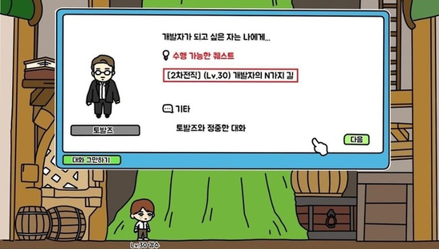

벌써 첫 회사에 온 지 1년 7개월, 573일이 지났는데요. 짧다면 짧고 길다면 길었던 첫 회사를 정리하고 새 회사로 이직하려고 합니다. 이직을 결정하는 데 까지 많은 고민이 있었고, 주변 동료분들의 잔류 설득도 있었지만, 그럼에도 불구하고 이직을 결정하게 되었습니다.

이번 글을 통해 어떤 생각을 가지고 이직을 결정하게 되었는지, 또 앞으로 계획에 대해 정리해보려고 합니다.

## 1. 왜 떠나는지

저는 원래 학교 개발팀에서 "서비스 시나리오 구상" 및 "DB 설계" 하는 것에 흥미가 있어 백엔드를 위주로 개발했었고, 웹 개발에도 관심이 있어 웹 프론트엔드도 종종 학습했었습니다. 그래서 취업을 준비할 때도 프론트엔드/백엔드 분야를 가리지 않고 여러 회사에 지원하였었습니다.

그 중 (지금은 퇴사한) 한 프롭테크 회사에 취업을 하게 되었는 데, 백엔드는 제 스펙과 다른 스펙으로 개발되고 있었습니다. 회사에 백엔드 스펙을 학습하여 투입되기에는 시간적 문제가 있으리라 생각되어, 그간 학습한 프론트엔드 스펙을 이용하여 웹 프론트엔드를 개발하기로 하였습니다.

물론 백엔드를 하지 못하는 것은 아쉬웠지만, 프론트엔드를 꾸준히 하여 앞으로 프론트엔드 개발자로서 커리어를 쌓아도 되고, 추후에 백엔드로 커리어를 변경하더라도 프론트엔드 개발 경험, 경력이 있으면 도움이 되리라 생각하여 프론트엔드를 하는 것에 거부감이 들진 않았습니다.

그렇게 다니는 동안 커리어에 대해 항상 고민이었는 데, 어느 분야든 상관없다면 좀 더 흥미 있는 분야를 하자는 생각이 들어 최종적으로는 **백엔드 커리어를 쌓아가기로** 하였습니다. 물론 현 회사에 남아서 백엔드를 할 수도 있었지만, 여러 리소스나 코드리뷰와 같은 개발문화가 조금은 부족하기도 하였고 다른 회사의 개발 방식에 대해 궁금하기도 하여서, 회사에 기여도 하면서 개인의 성장도 할 수 있는 회사로 이직을 결정하게 되었습니다.



## 2. 회사에서 배운 것

1년 7개월이라는 기간 동안 기술적으로나 협업적으로 배운 것들이 참 많았는데요. 그중에서도 저의 성장과 배움에 도움이 되었던 것들을 적어보겠습니다.

### 2-1. 문서화의 중요성

문서화는 마치 개발 기간을 증가시키는 계륵과 같이 보일 수 있지만, 문서화가 주는 이점은 다양합니다.

1. 히스토리 관리의 용이성 (프로젝트의 개요와 설계 등)
2. 인수인계의 비용 감소 및 간편화
3. **용어 통일을 통한 소통 비용 감소**

기본적으로 문서화는 1번과 2번의 목적&장점이 있는데요. 이번에 제가 느낀 문서화의 이점에는 3번이 있습니다.

만일 용어나 명칭이 통일되지 않은 상태에서 개발자 간에 협업을 했을 때, 소통에 문제가 발생할뿐더러 코드에서도 서로 다른 명칭을 사용하는 문제가 발생할 수 있습니다. 특히 비개발직군인 경우, 개발용어나 특정 영어명칭이 생소할 수 있기 때문에 이러한 경우 소통비용이 배로 듭니다.

저는 이러한 문제를 해결할 수 있는 방법 중 하나가 바로 **문서화**라고 생각합니다. 회사에 문서화를 굉장히 잘하는 시니어분이 계셨는데, 그분이 일하는 방식을 살펴보면 개발 초기에 설계 및 문서화를 진행하여 프로젝트에 사용되는 용어를 정리하고, 이를 모든 직군의 팀원들과 공유하는 것을 통해 프로젝트의 소통 비용을 감소시키고 원활한 소통이 가능하도록 하는 것이었습니다.

한 예시로 "쇼핑몰에서 판매하는 것" 이라고만 하여도 당장 한국어로는 "상품", "제품", "물건", 영어로는 "product", "goods", "item" 등 여러 가지 단어가 있습니다. 물론 의미에 디테일한 차이는 있겠지만 소통에 혼돈을 주기엔 충분합니다.

실제로 문서화를 디테일하게 해놓은 덕분에 사내에서 새로운 분이 오실 때 인수인계가 굉장히 수월하였고, 기획자 및 디자이너분과 소통할 때 간단한 설명만으로 빠른 커뮤니케이션이 가능했습니다.

### 2-2. 상황 판단 능력


**개발자는 결국 개발이라는 기술을 이용하여 비즈니스 밸류를 창출해내는 사람입니다.** 그렇게 때문에 이를 위한 **플러스 기여**를 하기 위해서는 현재 상황에 맞는 판단을 해야합니다.

이러한 점에서 제가 배운 판단 부분은 바로 개발, 코드적인 부분입니다. 개발자라면 한 번쯤은 **깔끔하고 좋은 코드**를 쓰기위해 고민해본적이 있을 것입니다. 여기서 "깔끔하고 좋은 코드"란 제가 생각하기에 유지보수성이 좋고 확장성이 있는 코드라고 생각합니다.

그렇기 때문에 저는 레거시를 최소화를 위해 항상 좋은 코드를 작성하는 것을 지향해왔었습니다. 단순히 개발적으로만 판단했던 것이였죠. 이에 따른 장점도 있었지만 때론 기한을 맞추기 버거울 때가 있었고 비즈니스에 플러스 기여를 하지 못할 때도 있었던 것 같습니다.

하지만 회사 특히 스타트업에선 비즈니스 타이밍에 맞추기 위해 가독성이 좋지 않고 중복 있는 "프로토타이핑 코드"를 작성해야할 수 있으며, 때론 비즈니스의 확장성과 서비스의 안정성을 위해 "지속가능한 코드"를 작성해야할 수 있습니다.

즉, "좋은 코드"란 맥락에 따라 바뀔 수 있는 것입니다.

그래서 이런 비즈니스와 맥락에 맞는 "좋은 코드"를 작성하기 위해서는 항상 비즈니스에도 관심을 가지고 소통하며 그에 맞는 개발을 할 수 있어야한다는 점을 다시금 깨닫게 되었으며, 이러한 판단력을 통해 개발 시 단순히 코드를 예쁘게 짜기위한 코더(Coder)가 아닌 **엔지니어(Engineer)의 관점**에서 생각할 수 있었던 것 같습니다.

> [이규원님의 페이스북 포스트](https://www.facebook.com/gyuwon.yi/posts/4954215174621666) <br /> [이규원님의 "좋은 코드란 무엇인가"](https://gyuwon.github.io/blog/2020/07/31/what-is-good-code.html)

## 3. 회사에 아쉬운 점

회사에 아쉬운 점은 많습니다.<br/>
다만, "그 아쉬운 점을 회사에서 채워주면 퇴사하지 않았을 것이냐" 라고 한다면 그건 아닙니다.

회사에 대한 불만으로 떠나는 게 아니라 1번에서 말한 이유로 떠나는 것이기 때문에 회사에서 해줄 수 있는 것은 없습니다.

하지만 회사가 발전하였으면 하는 마음으로 몇 가지 개선되었으면 하는 점에 대해 써보려고 합니다.

### 3-1. 선 개발, 후 기획 방법론

제목부터 굉장히 난감합니다. 처음 저 말을 듣고 이게 말이 되나 싶었는 데, 결론적으로 말하면 **주먹구구식 개발**을 뜻합니다.

프로토타입의 프로덕트를 만들거나, 사업 초기에 제품을 빠르게 만들어내야 하는 상황에서 주먹구구식 개발이 최선일 수 있지만, 회사가 성장하며 서비스를 확장하고 스케일업을 할 때 주먹구구식 개발방법론은 명확한 한계가 있습니다.

기획이란 비즈니스의 확장과 경쟁력을 위해서는 현재 시장 트랜드와 니즈 파악하여 **요구사항을 분석**하고 어떻게 서비스를 만들어 새로운 가치를 창출하고 어떤 비즈니스 모델을 통해 수익을 낼 것인지를 생각하는 단계입니다. 하지만 주먹구구식으로는 이러한 고민을 담기 어려우며, 조금만 더 크고 복잡한 소프트웨어를 만들려고 하면 분석/설계가 없어 완성도 높은 서비스를 만들 수 없습니다.

회사는 비즈니스를 확장하고 스케일업 하려고 하지만, 개발팀은 여전히 주먹구구식 개발을 고수하고 있기 때문에 **선 개발, 후 기획** 이라는 말이 나온 것 같습니다. 이 때문에, 개발자가 먼저 (셀프 기획을 하여) 주먹구구로 개발하고, 추후 나온 기획서에 맞게 재개발하는 식으로 2번 개발하여 "개발자의 리소스를 낭비하는 개발"이 이루어지고 있었습니다.

많은 개발자의 반대에도 "선 개발, 후 기획"하여 **빠르게만** 만드는 것을 중요히 하고 이 자체를 개발문화라고 생각하시는 분이 있는데, 여러 설득에도 쉽게 변하지 않는 점에서 아쉬움을 느꼈던 것 같습니다.

> [전규현님의 "주먹구구식 개발이 통하는 이유"](http://www.allofsoftware.net/2012/08/blog-post_27.html)

### 3-2. 소통, 공유와 투명성

회사에는 몇 가지 Private 하게 관리되는 프로젝트들이 있습니다. 이 프로젝트들은 두 가지로 나뉘는데,

- **첫 번째는 전설이 되어 구전으로만 히스토리를 알 수 있는 프로젝트입니다.** <br />
  보통 한 명의 개발자만 투입되었던 프로젝트가 이러한 데, 이런 프로젝트는 문서나 주석 등의 인수인계 자료가 존재하지 않아, 추후 해당 프로젝트를 담당하는 개발자에게 어려움으로 다가옵니다.

  따라서 인수인계 절차를 체계화하여, 회사의 자원이 훼손되는 일이 없도록 해야합니다.

- **두 번째는 회사의 비즈니스적으로 중요한 프로젝트입니다.** <br />
  이러한 프로젝트를 Private 하게 관리하는 게 뭐가 문제가 되냐고 할 수 있지만, 이 중 몇몇 프로젝트는 느린 속도와 트래픽 처리, 높은 인프라 비용 등으로 개선이 필요한 것들이 있습니다. 하지만 어떤 명목으로도 접근이 승인되지 않아 문제 해결에 어려움을 겪는 것을 보았습니다.

  비밀유지 명목으로 그럴 수 있지만, 서비스 전체에 영향을 주는 경우에는 문제점 파악을 위해서라도 일부 개선 능력이 있는 개발자에게는 공유가 되어야 합니다. 그래야지만 특정 개발자가 기술 뒤에 숨어 (쓸데없는) 전문성을 유지하는 행위를 방지하고, 비즈니스에 도움이 되도록 서비스를 향상시킬 수 있기 때문입니다.

## 4. 앞으로의 계획

이번에 새롭게 가는 회사는 에듀테크 분야의 회사인데, 학교에서 수업을 듣고 배우는 과정에서 발생하는 여러 불편함과 문제점을 해결한다는 점에 흥미를 느껴 해당 회사로 이직을 결정하게 되었습니다. 해당 회사에서는 백엔드 서버 개발 및 인프라 관리를 맡게 될 예정입니다.

또한 이번 이직을 준비하면서 알고리즘을 푸는 것에 조금 어려움이 있었던 것 같습니다. 알고리즘을 풀긴 했지만 여전히 부족하다는 것을 느꼈고, 왜 사람들이 JS로 문제를 많이 안푸는지 알게 되었습니다 (자료구조 같은 언어적 지원 부족). 그래서 이번 기회에 C++ 나 Python을 학습하며 알고리즘을 풀어볼 계획입니다.

## 5. 마무리

이직을 준비하면서 저에게 응원과 격려로 큰 힘을 주셨던 분들과, <br />
함께 일하며 저에게 정신적 지주가 되주셨던 분들께 정말로 감사드립니다. 🙇

새로운 회사로 가는 마음이 걱정되면서도 한편으론 기대가 되는데요. 많은 분들의 도와주신 만큼 열심히 해보겠습니다. 😁

---

끝으로, 새 회사로 가기 전 저에게 **자기 성장**에 영감을 준 영상을 공유하고 글을 마치겠습니다.

> [존잡생각 - 본인을 빠르게 성장시키는 방법](https://www.youtube.com/watch?v=drBdnrlsq9o)

```toc

```
