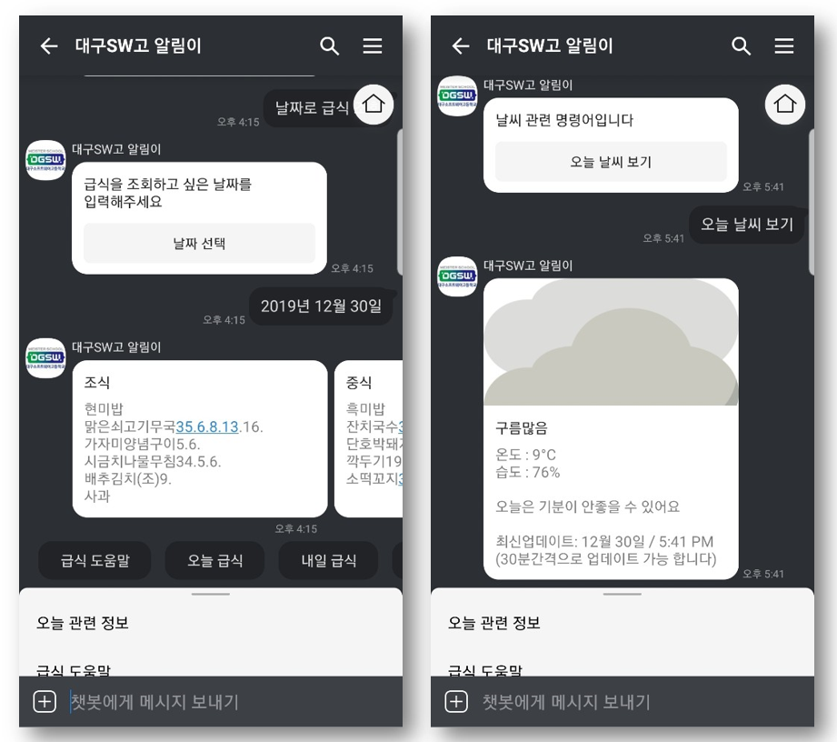
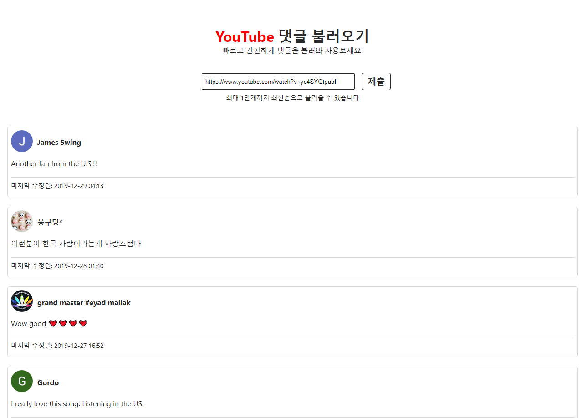
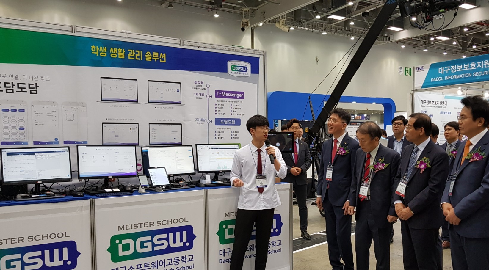

2019년 한 해가 얼마 남지 않았군요. 12월 달이 되기 전에 미리 써야지 하다가 진짜 12월 마지막 날이 되서 쓰게 되네요...😅 그래서 2019년이 가기전에, 2019년을 반성하고 되돌아 보면서 올해보다 멋진 2020년을 준비해보려고 합니다.

## 📆 2019 이모저모

2019년에는 딱 두 가지 목표가 있었는 데, 첫째는 제가 들어간 팀의 코드를 마스터(?)하는 것이었고, 두 번째로는 아무 서비스나 한가지라도 실사용해보는 것이었습니다.

목표는 제가 성장할 수 있도록 도와줬지만 반대로 성장을 막기도 했던 것 같아요.

첫 번째 목표는 반 년만에 달성했었습니다. 정확히는 **제가 생각하기에** 마스터했다고 착각한 것이었죠. 이것을 깨닫지 못하고 달성했다고 생각했을 때, 성장이 멈추는 느낌을 받았습니다. 그래도 아주 늦게 깨닫지는 않아서 현재 더 좋고 효율적인 코드를 쓰기 위해 노력하고 있습니다.

두 번째 목표는 달성하지 못한 목표입니다. 개인적으로 프로젝트를 할 시간을 만들지 못한 탓도 있고, 중간에 번아웃도 와서 포기해버렸던 목표였던 것 같습니다. 오히려 만들어야 한다는 스트레스 때문에 더욱 하기 싫었던 것 같아요. 새해에는 이 목표를 차근차근 정복해가며 이뤄가야겠습니다.

결과적으로 2020년에는 지속적이고 장기적인 목표를 잡고 이루어나가서 알찬 1년을 만들어 보고 싶네요.

---

## 🌱 개발자로서의 성장

현재 팀의 코드를 이해하고 리팩토링해가고 있지만, 2학년 학기 초에 처음 서버 개발팀에 들어 갔을 때였습니다. 프론트만 하다가 이제 겨우 막 자바스크립트로 서버 튜토리얼 정도 해본 상태였는 데, 선배분들의 백엔드 프로젝트 코드를 봤을 때는 거대한 산을 보는 기분이였어요...ㅎㄷㄷ

지금 생각해보면, html와 css를 짜는 것이 지루해서 그런 것이 없는 서버로 도피하기 위해 서버팀에 지원했던 것 같습니다. **여전히 배울 것이 많지만** 지금은 예전보다 조금은 나아진 코드를 작성하고 있는 것 같습니다. (아마도?)

한 해 동안 개발을 하면서 아래 내용에 자연스럽게 익숙해진 것 같습니다.

### - 학습

처음 아무것도 모른 체로 선배분들의 코드도 분석해보고 팀에서 사용 중인 기술을 공부하면서 **선배들처럼** 코드를 짜려고 노력했었던 것 같아요. 물론 남이 쓴 좋은 코드가 있다면 따라 쓰는 것도 좋지만 안보고 자신이 직접 코드를 구현해보면서 공부하는 것이 더욱 좋은 공부 방법이 되었을 것 같다는 생각이 드네요.

스스로 기술문서를 찾아보면서 필요한 기능들을 차근차근 사용하면서 익히는 것, 또한 모르는 것이 있다면 구글에 검색하여 자급자족(?)하는 것이 저의 실력 향상에 많은 도움을 줬던 것 같습니다. 여전히 영어 문서를 볼 때면 이해가 잘 가지 않지만, 새해에는 영어 공부도 틈틈이 해서 문서를 더 잘 읽을 수 있도록 노력해보려고 합니다.

### - Git 사용과 코드관리

예전에는 코딩을 할 때, 혼자 했기 때문에 Git을 저장용으로만 썼는데, 팀 프로젝트를 진행하면서 코드를 공유하고 같이 협업하는 팀원을 위해 코드 관리를 해줘야만 했습니다. 이를 위해 **issue**, **Pull Request**하는 것과 **코드 리뷰**하는 것을 통하여 코드를 관리하는 방법과 Git 사용법을 알게 되는 좋은 기회가 되었던 것 같아요.

또 최근에는 그냥 블로그 보듯이 다른 분의 Git을 팔로우 하면서 심심할 때마다 코드를 읽고 있습니다. 의외로 심심할 때 보면 시간이 잘 가더라고요.

### - 소통의 중요성

혼자서 프로젝트를 할 때는, 혼자 기획하고 개발하기 때문에, 누군가에게 현제 진행 상황과 코드의 주석 작성할 필요가 없었습니다. 하지만 팀 프로젝트를 하면서 남이 나의 코드를 알아볼 수 있도록 (필요하다면) 주석을 써주는 것이 좋고 진행이 어느정도로 되었는지 선배(상사, 사수)에게 알려줄 의무가 있는 것 같습니다.

이전 프로젝트에서 소통이 잘 안 되어서 다른 팀원이 어떤 것을 하고 있고 얼마 만큼 되었는지 알지 못해 진행도가 느려지는 결과를 낳았었습니다. 결국 프로젝트가 지연되었고 기한을 맞추기 위해 코드의 질도 떨어졌던 것 같습니다. 소통의 중요성을 뼈저리게 깨닫게 됐던 것 같아요.

원인을 해결하기 위해 팀원과 같이 게임(?), 운동하면서 친밀도를 올리기 위해 노력하였고 **Slack**이라는 협업툴을 도입하여 공지와 정보공유를 손쉽게 하기 위해 노력했던 것 같습니다.

---

## 💻 사이드 프로젝트

주로 팀에서 하는 프로젝트를 위주로 하다 보니 사이드 프로젝트를 듬성듬성하고 완성한 것도 별로 없는 것 같아요. 이 학교를 나가기 전에는 프로젝트 하나라도 배포하고 나가자는 것이 제 목표라서 틈틈히 준비해야 할 것 같아요. 내년에는 학교에 필요한 사이드 프로젝트를 해보려고 합니다

아래는 올해 했었던 개인 사이드 프로젝트입니다.

### - 카카오 챗봇, "대구SW고 알림이"

학교 급식과 학교의 기상 날씨를 알려주는 카카오톡 챗봇입니다. 처음으로 챗봇을 만들어봤는데 재밌었던 것 같습니다. 현재 진행중인 있는 도담도담 프로젝트와 연동하면 재미있는 플랫폼이 탄생할 수 있을 것 같아요.



### - 유튜브 댓글 픽커

유튜브 영상의 댓글을 불러와서 보여주는 서비스입니다. (놀랍게도 진짜 댓글만 보여준다)
이때 아마 처음으로 해본 리액트 토이 프로젝트였던 것 같아요.
내년에 기회가 된다면 리팩토링도 한번하고 좀 더 보기 쉽게 만들어 보고 싶네요.
https://youtube-comment-picker.netlify.com/



---

## 🏃 B1ND 팀장

B1ND팀에 대해 잠깐 소개하자면 학교에 필요한 서비스를 만드는 스마트스쿨 플랫폼 개발팀입니다.

학기 초에 팀에 팀장을 뽑기 위해, 지원하고 싶은 사람은 이야기해달라고 하였습니다. 하지만 지원하는 학생이 없었어요... 그때 **누군가 해야 할 일이면 내가 하라** 라는 말이 생각났었던 것 같아요. 그 때 왜 그런 말이 생각 났는지 모르겠지만 이 말에 어찌 모를 자신감과 한 번 해보는 것도 좋은 경험이 될 것 같아 도전하게 되었어요.

결국 팀에 팀장을 맡게 되어서 프로젝트를 할 때, 회의를 진행해보기도 하고, **2019년 ICT 융합 엑스포**에서 팀과 학교를 대표로 많은 VIP 앞에서 저희 팀이 하였던 도담도담 프로젝트를 발표하기도 하였어요.


**_2019 ICT 융합 엑스포 도담도담 발표_**

사실 평소 수업 시간에 하는 발표 같은 것은 평범하게 하지만, 사람이 많은 곳에서 마이크를 들고 발표를 하면 손, 다리가 떨려고 심장이 빨리 뛰어서 말을 잘하지 못하는 습관이있는데 B1ND 팀에서 팀장을 하면서 프로젝트 회의도 진행해보고, 1, 2학년 학생들에게 저희 프로젝트를 소개하기도 하는 자리, ICT를 통해서 점점 떨림도 줄어들고 말도 이전보다는 부드러워지게 되었던 것 같아요.

반 학기라는 짧은 기간 동안 팀장을 맡으면서 고민도 많이 하고 잘해야 한다는 스트레스를 받기도 하였지만, 개발자로서, 또 리더로서 많은 성장을 할 수 있도록 도와준 고마운 자리였던 것 같습니다.

부족하고 별로 한 것도 없는 팀장 믿고 따라와 준 팀원들에게 고맙다는 말을 해주고 싶네요 🥰

---

## 🤐 시간관리 중요성

학교에서 항상 노트북을 가지고 있기 때문에, 언제 어디서든 원한다면 코딩을 즐길 수(?) 있지만 그 말은 즉 슨 개발 외에의 것에도 언제든지 시간을 투자해야 할 수 있다는 것을 의미인 것 같습니다. 그래서 코딩하다가 좀 지루하거나 피곤하면 유튜브나 웹툰을 켜서 즐기곤 하는데, 열심히 즐기다 보면 시간 가는 줄 모르고 즐기는 것 같아요.

2019년 2학기부터는 효율적인 시간 관리와 해야 할 일, 쉬는 일(?)을 잘 분배하기 위해 **Todoist**를 과감하게 결제하여 사용하고 있습니다. 하지만 요즘에는 처음 쓸 때보다 뜸하게 사용하고 있는 것 같아요...내돈...

그래도 항상 켜놓고 생각나는 게 있을 때마다 적으면서 사용하고 있습니다. ~~돈이 아까워서라도~~

---

## 📝 인생 첫 인턴쉽 지원

학교에서 면접을 볼 수 있는 기회가 생겨서 면접을 지원해서 봤는데, 면접 질문에서 기술적인 질문들이 난무하여 잘 대답하지 못한 것들이 있었습니다. 덕분에 이론적인 것들을 다시 공부하게 되는 좋은 기회가 되었던 것 같아요. 기술의 활용도 중요하지만, 이론도 알고 응용하는 것이 중요하다는 것을 알게 해주는 좋은 면접이었던 것 같습니다.

- [면접 질문 리스트](/나의-첫-인터뷰-질문-리스트)

---

## 🌟 2020년 새해 목표

새해에는 새로운 도전에 해가 될 것 같네요. 이제 고3이니 졸업도 하고 취업도 해야 하니 열심히 새해를 달려보려고 합니다.

- Golang 공부해보기
- 시간관리, Todoist를 더욱 열심히 사용하기
- 도담도담 서비스 배포하기
- 1일 1커밋 해보기
- **취업하기**

```toc

```
